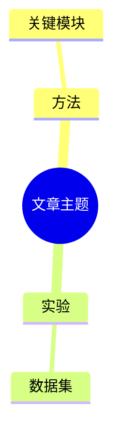

# Zotero AI 批注整理插件——技术设计文档
> 兼容性说明：本文档以 Zotero 9.x 为目标版本。具体实现时，所有菜单、Item Pane、PDF Reader、批注读取和插件生命周期 API 都必须以当前 Zotero 9 官方文档、示例插件和实际类型定义为准，不得仅通过将旧版文档中的版本号替换为 9 来判断兼容性。

> 文档版本：V1.0  
> 日期：2026-07-13  
> 目标平台：Zotero 9，优先支持 Windows 与 macOS  
> 技术目标：可靠读取 Zotero PDF 批注及原文上下文，通过大模型生成自然的 Markdown 笔记和思维导图；内部保留依据映射和一致性校验，但默认不展示在最终文档中。

---

## 1. 技术范围

### 1.1 V1.0 包含

- Zotero 9 插件基础框架；
- 读取当前文献、PDF 附件和批注；
- 获取 PDF 文本及批注附近上下文；
- 用户关注点识别与确认；
- OpenAI-compatible 模型调用；
- 两阶段 Prompt；
- 结构化 JSON 输出；
- 内部内容依据与一致性校验；
- Markdown 笔记预览、编辑、写回；
- Markdown 文件导出；
- Markmap / Mermaid 思维导图输出。

### 1.2 V1.0 不包含

- 自建云端账号和后端；
- 多用户协作；
- 向量数据库；
- 批量文献综述；
- 扫描 PDF 的完整 OCR；
- 自动发表或共享笔记；
- 原生 `.xmind` 文件写入。

---

## 2. 技术栈

```text
TypeScript
Zotero 9 Plugin API
Zotero JavaScript API
HTML / CSS / Zotero UI Components
OpenAI-compatible REST API
JSON Schema / Zod
Markdown-it 或同类 Markdown Parser
Markmap / Mermaid
Vitest 或 Jest
ESLint + Prettier
```

### 2.1 项目骨架建议

可参考与 Zotero 9 兼容的官方 sample plugin，或已明确支持 Zotero 9 的 TypeScript 插件模板，但业务代码应保持独立，避免深度绑定非官方工具库。

---


## 2.2 Zotero 9 兼容策略

- 最低目标版本：Zotero 9.0；
- 主要测试版本：用户当前安装的 Zotero 9.x 具体版本；
- 插件清单中的兼容范围应基于实际测试填写；
- 菜单、Item Pane、PDF Reader 和批注 API 必须通过 Zotero 9 官方示例或类型定义验证；
- 将 Zotero 相关调用集中封装在 `src/zotero/` 目录，避免业务代码直接依赖易变化的内部 API；
- 每次 Zotero 9 小版本升级后执行安装、加载、批注读取、笔记写回和卸载回归测试。

---

## 3. 目录结构

```text
zotero-ai-notes/
├── addon/
│   ├── manifest.json
│   ├── bootstrap.js
│   ├── chrome.manifest
│   ├── locale/
│   │   ├── zh-CN/
│   │   └── en-US/
│   └── content/
├── src/
│   ├── bootstrap.ts
│   ├── addon.ts
│   ├── domain/
│   │   ├── item.ts
│   │   ├── annotation.ts
│   │   ├── evidence.ts
│   │   ├── claim.ts
│   │   └── generation.ts
│   ├── zotero/
│   │   ├── item-repository.ts
│   │   ├── annotation-repository.ts
│   │   ├── pdf-text-provider.ts
│   │   ├── note-repository.ts
│   │   └── link-builder.ts
│   ├── grounding/
│   │   ├── context-locator.ts
│   │   ├── evidence-builder.ts
│   │   ├── focus-detector.ts
│   │   ├── claim-validator.ts
│   │   └── citation-validator.ts
│   ├── llm/
│   │   ├── provider.ts
│   │   ├── openai-compatible.ts
│   │   ├── prompt-builder.ts
│   │   ├── response-parser.ts
│   │   └── token-estimator.ts
│   ├── application/
│   │   ├── create-generation-task.ts
│   │   ├── analyze-focus.ts
│   │   ├── generate-outline.ts
│   │   ├── generate-note.ts
│   │   └── save-result.ts
│   ├── ui/
│   │   ├── settings/
│   │   ├── generation-dialog/
│   │   ├── focus-review/
│   │   ├── result-preview/
│   │   └── history/
│   ├── export/
│   │   ├── markdown-exporter.ts
│   │   ├── markmap-exporter.ts
│   │   └── mermaid-exporter.ts
│   └── utils/
├── tests/
├── package.json
├── tsconfig.json
└── README.md
```

---

## 4. 领域模型

## 4.1 DocumentItem

```ts
export interface DocumentItem {
  libraryID: number;
  itemKey: string;
  title: string;
  authors: string[];
  year?: string;
  abstract?: string;
  doi?: string;
  attachment: PdfAttachment;
}
```

## 4.2 AnnotationRecord

```ts
export interface AnnotationRecord {
  id: string;
  itemKey: string;
  attachmentKey: string;
  type: "highlight" | "note" | "image" | "ink" | "underline";
  text?: string;
  comment?: string;
  color?: string;
  tags: string[];
  pageLabel?: string;
  sortIndex?: string;
  position?: unknown;
  createdAt?: string;
  modifiedAt?: string;
  zoteroLink?: string;
}
```

## 4.3 EvidenceUnit

```ts
export interface EvidenceUnit {
  id: string;
  sourceType:
    | "annotation"
    | "annotation_context"
    | "abstract"
    | "introduction"
    | "conclusion"
    | "fulltext";
  page?: number;
  pageLabel?: string;
  section?: string;
  text: string;
  annotationId?: string;
  userComment?: string;
  zoteroLink?: string;
  contentHash: string;
}
```

## 4.4 FocusTopic

```ts
export interface FocusTopic {
  id: string;
  title: string;
  description: string;
  annotationIds: string[];
  evidenceIds: string[];
  reason: string;
  priority: number;
  userConfirmed: boolean;
}
```

## 4.5 InternalContentMapping

该结构仅用于后台校验，不直接写入最终笔记。

```ts
export interface InternalContentMapping {
  id: string;
  generatedText: string;
  sourceKind: "document" | "user_annotation" | "synthesis";
  evidenceIds: string[];
  confidence: "high" | "medium" | "low";
  needsReview: boolean;
}
```

---

## 5. Zotero 数据读取

## 5.1 获取当前选中文献

伪代码：

```ts
const selectedItems = Zotero.getActiveZoteroPane().getSelectedItems();

if (selectedItems.length !== 1) {
  throw new UserError("请选择一篇文献");
}

const item = selectedItems[0];
```

正式实现时需根据 Zotero 9 当前官方 API、示例和类型定义做兼容封装，不在业务层直接散落调用。

## 5.2 获取 PDF 附件

处理：

- 当前选择为父文献；
- 当前选择本身为 PDF 附件；
- 一个父文献有多个 PDF；
- PDF 文件不存在；
- 链接附件不可访问。

多个 PDF 时让用户选择附件，或默认选择主要 PDF。

## 5.3 获取批注

Zotero 的内置 PDF 批注作为子 Item 存储在 Zotero 数据库中。读取时应：

- 按附件筛选；
- 排除已删除条目；
- 按 `sortIndex` 排序；
- 保留用户评论和标签；
- 保留 Annotation Key；
- 不直接读取 SQLite。

## 5.4 构造原文链接

优先复用 Zotero 生成的 annotation link 或 note 中使用的链接格式。不要自行硬编码未公开稳定的内部 URI 结构。

若无法获得精确批注链接，至少生成：

- 打开对应 PDF 的链接；
- 页码信息；
- Annotation Key 供插件内部定位。

---

## 6. PDF 文本获取与上下文定位

## 6.1 文本获取策略

### 策略 A：Zotero 已索引全文

优先使用 Zotero 本地全文索引或 Zotero 可访问的文本缓存。

优点：

- 无需额外解析；
- 与 Zotero 本地数据一致；
- 性能较好。

### 策略 B：PDF.js

若可从 Zotero 阅读器或 PDF.js 接口获取逐页文本，则构建：

```ts
interface PdfPageText {
  pageIndex: number;
  text: string;
  spans?: TextSpan[];
}
```

### 策略 C：独立解析

仅在前两种不可用时采用，避免引入体积和兼容性问题。

### 扫描型 PDF

V1.0 返回：

> 当前 PDF 无可提取文本，只能根据已有高亮和评论整理。

OCR 放入后续版本。

## 6.2 批注定位

优先级：

1. 使用 annotation position 定位；
2. 使用页码 + 高亮文本精确匹配；
3. 使用模糊匹配；
4. 仅使用批注本身，不补上下文，并添加警告。

## 6.3 上下文窗口

默认：

- 当前段落；
- 前后各一段；
- 最大 1,500～2,500 中文字符或同等 Token；
- 附带所在章节标题。

不得简单截取固定字符导致句子断裂。应按段落和句子边界切分。

---

## 7. 证据构建算法

## 7.1 内部 Evidence ID

Evidence ID 仅用于程序内部定位、校验和调试，默认不显示在用户笔记中。

格式：

```text
E-{attachmentKey}-{page}-{sequence}
```

示例：

```text
E-ABCD1234-8-03
```

## 7.2 去重

两条证据满足以下条件时可合并：

- 文本标准化后高度相似；
- 来自同一页相邻位置；
- 对应同一批注或重叠高亮。

保留所有来源 annotation ID。

## 7.3 内容哈希

对规范化文本生成 SHA-256 或轻量哈希，用于：

- 校验模型引用；
- 防止证据被静默修改；
- 缓存；
- 生成历史对比。

---

## 8. 关注点识别

## 8.1 规则预处理

先通过代码生成信号：

```ts
interface FocusSignal {
  annotationId: string;
  commentWeight: number;
  tagWeight: number;
  colorWeight: number;
  textLengthWeight: number;
  repeatedTopicWeight: number;
}
```

建议：

- 有用户评论：高权重；
- 有标签：中高权重；
- 用户配置过颜色含义：中权重；
- 仅高亮：基础权重。

## 8.2 模型聚类

模型仅对批注做主题聚类，输出：

- 主题；
- 对应 annotation IDs；
- 形成主题的原因；
- 建议优先级。

模型不能添加不存在的 annotation ID。

## 8.3 用户确认

生成前展示：

```text
本次识别到的关注重点：
☑ 方法设计
☑ 实验结果
☑ 产品化限制
☐ 相关工作
```

用户确认后的结果写入 GenerationTask。

---

## 9. LLM Provider 设计

## 9.1 统一接口

```ts
export interface LLMProvider {
  id: string;
  testConnection(config: ProviderConfig): Promise<TestResult>;
  generateStructured<T>(
    request: LLMRequest,
    schema: JsonSchema
  ): Promise<T>;
}
```

## 9.2 OpenAI-compatible 配置

```ts
export interface ProviderConfig {
  baseURL: string;
  apiKey?: string;
  model: string;
  temperature: number;
  maxOutputTokens?: number;
  timeoutMs: number;
  customHeaders?: Record<string, string>;
}
```

## 9.3 安全

- API Key 在 UI 中遮挡；
- 日志不输出 Key；
- 导出配置时不包含 Key；
- 错误对象需清理请求头；
- 优先使用 Zotero 提供的安全凭据或首选项机制；
- 明确提示用户第三方兼容接口的数据政策由相应服务商决定。

---

## 10. 两阶段生成实现

## 10.1 第一阶段：Outline Plan

输入：

- Metadata；
- Focus Topics；
- Evidence Units；
- 输出模板。

输出 JSON：

```json
{
  "document_summary": "文章主旨",
  "user_focus_summary": "用户主要关注点",
  "outline": [
    {
      "heading": "核心方法",
      "purpose": "解释文章方法及用户关注问题",
      "evidence_ids": ["E1", "E2"]
    }
  ],
  "missing_information": [],
  "warnings": []
}
```

校验：

- 所有 Evidence ID 存在；
- 每个主要章节至少有一个证据；
- 若无证据则删除章节或标记缺失。

## 10.2 第二阶段：Grounded Note

输入：

- 已校验大纲；
- 只发送大纲引用的证据；
- 格式要求。

输出 JSON：

```json
{
  "markdown_note": "...",
  "content_mappings": [
    {
      "id": "M1",
      "generated_text": "对应的生成内容",
      "source_kind": "document",
      "evidence_ids": ["E1"],
      "confidence": "high",
      "needs_review": false
    }
  ],
  "mindmap_markdown": "...",
  "warnings": []
}
```

`content_mappings` 仅用于后台校验，最终保存的 Markdown 默认只使用 `markdown_note`。

---

## 11. 内部依据与一致性校验

校验模块不要求最终笔记显式标注内容类型，而是在后台判断生成内容是否有文献或用户批注支撑。

## 11.1 静态映射校验

```ts
function validateMapping(
  mapping: InternalContentMapping,
  evidenceMap: Map<string, EvidenceUnit>
) {
  for (const id of mapping.evidenceIds) {
    if (!evidenceMap.has(id)) {
      return { valid: false, reason: `Evidence ${id} does not exist` };
    }
  }
  return { valid: true };
}
```

## 11.2 数字校验

对生成内容中的以下信息进行严格检查：

- 百分比；
- 日期；
- 样本数；
- 指标值；
- 模型参数；
- 实验提升幅度。

相关数字必须能在绑定的原文片段中找到。无法找到时，应删除、重写或要求模型重新生成。

## 11.3 用户批注校验

凡是被写入“我的理解”“我的思考”“我的问题”等章节的内容，必须来自用户真实批注，或是对用户批注的忠实整理。

不得：

- 把用户提出的问题写成确定答案；
- 把模型补充内容伪装成用户观点；
- 改变用户原本表达的含义。

## 11.4 综合归纳校验

模型可以把多处原文整合成连贯总结，但必须满足：

- 至少有一处相关原文支撑；
- 不引入原文之外的新事实；
- 不把可能性写成确定结论；
- 不伪造作者动机、实验结论或适用范围。

## 11.5 最终笔记展示

最终笔记默认不显示：

- Evidence ID；
- Mapping ID；
- 内容来源类型；
- “AI 推断”“文章事实”等标签；
- 自动校验报告。

只有用户点击“查看依据”或系统发现高风险内容时，才打开来源面板或警告面板。

## 12. UI 设计

## 12.1 生成对话框

字段：

- 输出类型：笔记 / 思维导图 / 两者；
- 模板；
- 理解范围：
  - 仅批注；
  - 批注 + 相邻上下文；
  - 批注引导全文理解；
- 关注重点；
- 用户补充要求；
- 模型；
- 预计 Token；
- 隐私提示。

## 12.2 结果页

标签页：

1. 笔记；
2. 思维导图；
3. 原文依据（可选高级视图）；
4. 警告（仅存在问题时显示）。

操作：

- 编辑；
- 重新生成选中章节；
- 查看原文；
- 删除或重新生成疑似无依据内容；
- 保存 Zotero 笔记；
- 导出 Markdown。

---

## 13. 写回 Zotero

### 13.1 笔记生成

Zotero note 通常存储 HTML。插件内部以 Markdown 作为主格式，需要：

```text
Markdown
→ 清理
→ 转换为 Zotero 可接受 HTML
→ 创建子 Note
```

同时保存 Markdown 原文到生成历史，避免来回转换损失。

### 13.2 笔记元数据

笔记顶部增加：

```text
生成时间
使用模型
使用模板
生成模式
证据数量
插件版本
```

### 13.3 幂等性

默认每次创建新笔记，不覆盖旧结果。

后续可支持：

- 更新指定 AI 笔记；
- 比较差异；
- 保留历史版本。

---

## 14. Markdown 与思维导图导出

## 14.1 Markdown

要求：

- UTF-8；
- Windows/macOS 路径兼容；
- 清理非法文件名；
- 支持 YAML Frontmatter；
- 保留 Zotero Links；
- 图片资源放到相对路径目录。

## 14.2 Markmap

输出符合标准 Markdown 层级：

```markdown
# 文章主题
## 用户关注点
### 方法
### 实验
## 核心结论
```

## 14.3 Mermaid



生成思维导图时，不允许出现笔记中不存在、且无法从文献或用户批注中得到支持的独立结论。最终导图不需要显示 Evidence ID。

---

## 15. 缓存与任务状态

## 15.1 GenerationTask

```ts
export interface GenerationTask {
  id: string;
  itemKey: string;
  attachmentKey: string;
  status:
    | "created"
    | "extracting"
    | "analyzing_focus"
    | "planning"
    | "generating"
    | "validating"
    | "completed"
    | "failed"
    | "cancelled";
  inputHash: string;
  providerId: string;
  model: string;
  templateId: string;
  createdAt: string;
}
```

## 15.2 缓存键

```text
attachmentKey
+ PDF modified time
+ annotation content hash
+ template version
+ model
```

批注或 PDF 变化后缓存失效。

---

## 16. 错误处理

| 错误 | 用户提示 | 技术处理 |
|---|---|---|
| 没有 PDF | 当前文献没有可读取的 PDF | 终止任务 |
| 没有批注 | 请先添加批注，或启用全文模式 | 终止或切换模式 |
| PDF 无文本 | 无法提取 PDF 文本 | 仅批注模式 |
| API Key 错误 | 模型鉴权失败 | 不重试 |
| 限流 | 请求过于频繁 | 指数退避 |
| 超时 | 模型响应超时 | 允许重试 |
| JSON 错误 | 模型返回格式异常 | 修复一次后失败 |
| 无效引用 | 部分内容找不到依据 | 删除或标记待核实 |
| 用户取消 | 已取消生成 | 中止网络请求 |

---

## 17. 测试设计

## 17.1 单元测试

- Annotation 转领域对象；
- 文本规范化；
- Evidence ID；
- 去重；
- 数字提取；
- 内容依据映射校验；
- Markdown 文件名；
- JSON 解析。

## 17.2 集成测试

- Zotero 文献读取；
- 多附件；
- 中英文 PDF；
- 批注链接；
- Note 写回；
- 设置保存；
- 模型模拟响应。

## 17.3 Grounding 测试集

建立 20～50 篇内部测试 PDF，每篇人工制作：

- 批注；
- 标准关注点；
- 标准笔记；
- 可接受结论；
- 禁止生成结论；
- 证据映射。

指标：

- 内部依据映射正确率；
- 无依据内容率；
- 数字错误率；
- 用户观点误归因率；
- 关键批注覆盖率；
- 笔记保存率。

## 17.4 回归测试

每次修改 Prompt、模型或解析逻辑后，运行同一测试集，防止生成质量退化。

---

## 18. 开发顺序

### Sprint 1：插件与数据读取

- 初始化 Zotero 9 插件；
- 右键菜单；
- 获取 Item、PDF、annotations；
- 输出调试 JSON。

### Sprint 2：PDF 上下文与 Evidence

- PDF 文本；
- 批注定位；
- 上下文切片；
- Evidence Units；
- 原文链接。

### Sprint 3：模型与关注点

- 设置页；
- OpenAI-compatible；
- Focus Detection；
- 用户确认界面。

### Sprint 4：生成与校验

- Outline Prompt；
- Note Prompt；
- JSON Schema；
- 内部依据与一致性校验；
- 错误处理。

### Sprint 5：输出闭环

- Markdown 预览；
- Zotero Note；
- `.md` 导出；
- Markmap / Mermaid；
- 安装包。

### Sprint 6：质量优化

- 测试集；
- 性能；
- 跨平台；
- Prompt 调整；
- 文档和发布。

---

## 19. 技术验收条件

1. 可稳定读取 Zotero 9 当前文献的 PDF 批注；
2. 90% 以上文本高亮能定位到原文上下文；
3. 所有重要内容在后台均能映射到有效原文或用户批注；
4. 不存在的内部 Evidence ID 无法通过校验，但不会展示在正式笔记中；
5. 数字无依据时自动进入警告列表；
6. 用户评论不会被错误归为作者观点；
7. 生成结果可预览、编辑、写回和导出；
8. 生成失败不会修改原始批注；
9. API Key 不出现在日志中；
10. Windows 和 macOS 的中文路径可正常导出。

---

## 20. 官方技术依据

- Zotero 插件运行在 Zotero 桌面应用内，可调用 Zotero JavaScript API。
- Zotero 9 插件使用 WebExtension manifest，但并非普通浏览器 WebExtension。
- Zotero 内置 PDF 批注保存在 Zotero 数据库中，以支持同步和高级功能。
- Zotero PDF Reader 支持将批注加入笔记，并保留返回 PDF 页面和引用的信息。
- Zotero 官方更推荐通过 JavaScript API 或 Web API 访问数据，而不是直接操作 SQLite。